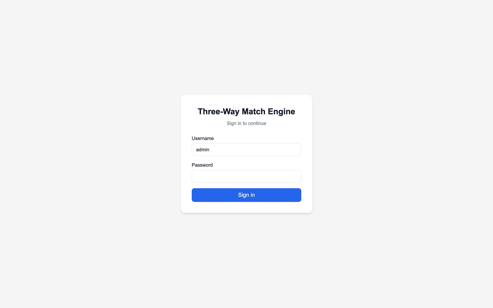
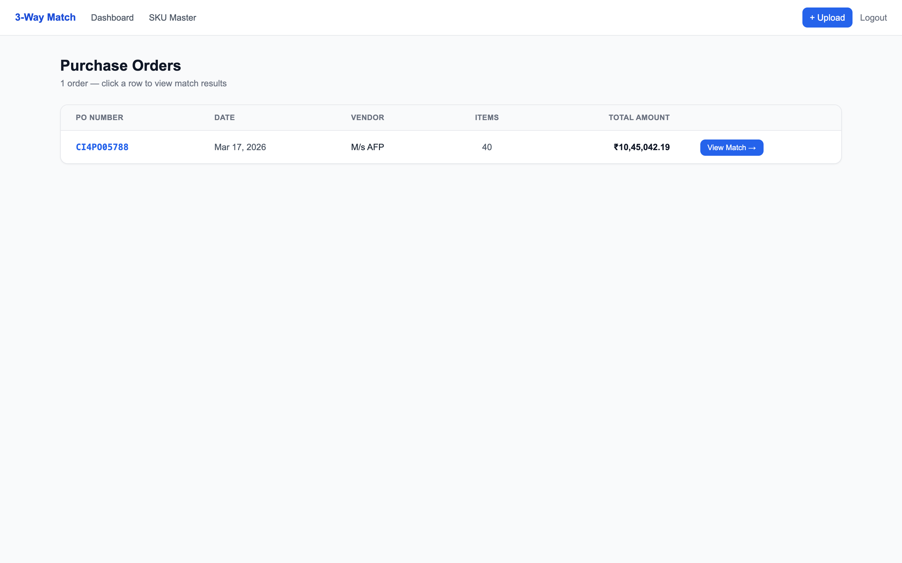
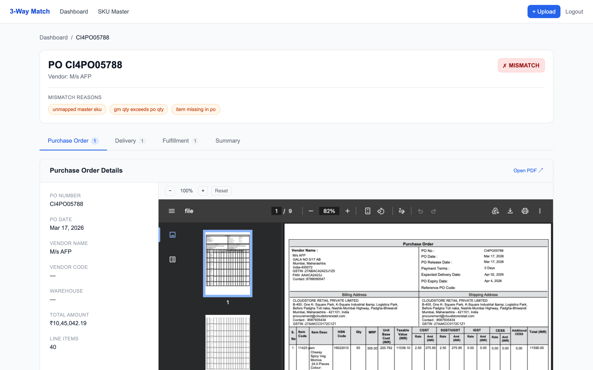
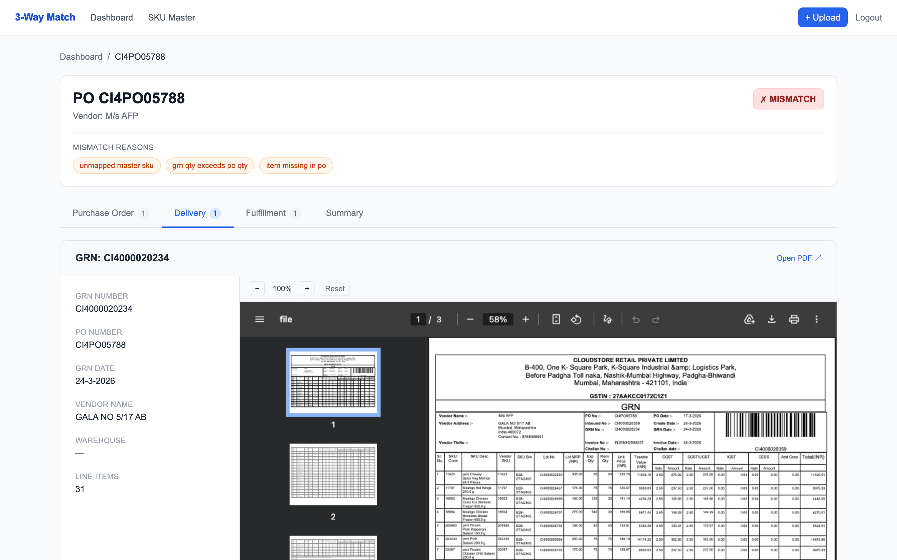
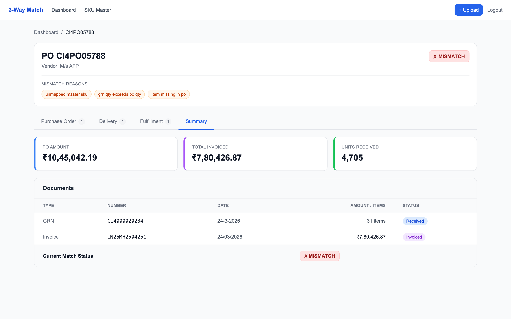
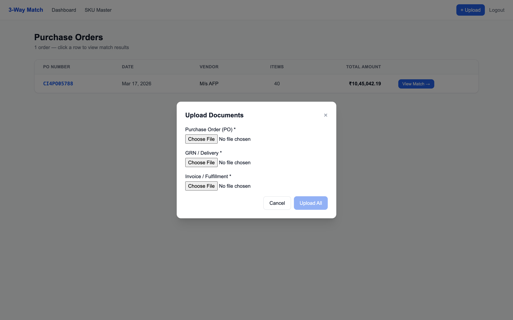

# Three-Way Match Engine

A full-stack procurement reconciliation system that automates the matching of Purchase Orders (PO), Goods Receipt Notes (GRN), and Invoices. Upload PDFs, let AI parse them, and instantly see whether your procurement documents are aligned — with detailed mismatch flags per line item.

---

## What It Does

In procurement, a **three-way match** verifies that:
- What was **ordered** (PO) matches what was **received** (GRN) matches what was **billed** (Invoice)

This engine automates that process end-to-end:

1. **Upload PDFs** — drag and drop PO, GRN, and Invoice PDFs
2. **AI Parsing** — Groq (Llama 3.3 70B) extracts structured JSON from the PDF text
3. **SKU Resolution** — line items are matched against a SKU Master catalogue via ERP code or EAN barcode
4. **Match Engine** — quantities, prices, and dates are compared across all three documents
5. **Dashboard** — view results in a 4-tab UI with mismatch highlighting and PDF previews

### Reason Codes (Mismatch Flags)

| Code | What It Means |
|---|---|
| `grn_qty_exceeds_po_qty` | More units received than were ordered |
| `invoice_qty_exceeds_grn_qty` | Invoice bills for more than was received |
| `invoice_qty_exceeds_po_qty` | Invoice bills for more than was ordered |
| `invoice_date_after_po_date` | Invoice date is after the PO date |
| `duplicate_po` | A second PO was uploaded for a `poNumber` that already has one |
| `duplicate_document` | A second GRN/Invoice reuses the same number under the same `poNumber` |
| `item_missing_in_po` | GRN/Invoice has an item not found in the PO |
| `price_mismatch` | Invoice unit rate deviates from agreed rate beyond tolerance |
| `mrp_mismatch` | MRP on GRN/Invoice differs from SKU Master MRP by more than ~1% |
| `unmapped_master_sku` | Item code not found in SKU Master catalogue |
| `insufficient_documents` | One or more of PO / GRN / Invoice is missing |

### Key Design Decisions

- **Out-of-order uploads**: GRN or Invoice can be uploaded before the PO — the match engine always recomputes from the database, never caches results
- **Duplicate uploads**: Re-uploading a document upserts the record and logs an audit event
- **SKU resolution**: Items are linked via `skuErpCode` → `eanCode` fallback — same product may have different text descriptions across documents
- **Price tolerance**: Per-SKU configurable (default 5%) — set in the SKU Master

---

## Screenshots

### Login


### Dashboard — Purchase Orders List


### Match View — Purchase Order Tab (with PDF preview)


### Match View — Delivery Tab (GRN with full PDF)


### Match View — Summary Tab (stat cards + document table)


### Upload Modal — Bulk upload PO + GRN + Invoice


---

## Tech Stack

### Backend
| Technology | Version | Purpose |
|---|---|---|
| **Node.js** | 18+ | Runtime |
| **Express.js** | 4.x | HTTP server and routing |
| **MongoDB** | Atlas (cloud) | Document database |
| **Mongoose** | 8.x | ODM — schemas, validation, queries |
| **Groq SDK** | latest | AI client for Llama 3.3 70B document parsing |
| **pdf2json** | latest | PDF text extraction before sending to LLM |
| **Zod** | 3.x | JSON validation with `numStr` coercion for LLM output |
| **Multer** | 1.x | Multipart file upload handling |
| **jsonwebtoken** | 9.x | Static Bearer token auth |
| **dotenv** | 16.x | Environment variable loading |
| **nodemon** | 3.x | Dev auto-restart on file changes |

### Frontend
| Technology | Version | Purpose |
|---|---|---|
| **Next.js** | 14.x (App Router) | React framework with file-based routing |
| **React** | 18.x | UI library |
| **TypeScript** | 5.x | Type safety across all components |
| **Tailwind CSS** | 3.x | Utility-first styling |
| **TanStack Query** | v5 | Server state management — cache invalidation on upload |
| **Axios** | 1.x | HTTP client with auth interceptor |

### AI / LLM
| Service | Model | Purpose |
|---|---|---|
| **Groq** | `llama-3.3-70b-versatile` | Extracts structured JSON from PO, GRN, Invoice PDF text |

### Infrastructure
| Service | Purpose |
|---|---|
| **MongoDB Atlas** | Hosted MongoDB (free tier M0) |
| **Groq API** | Free LLM inference (14,400 req/day free tier) |

---

## Architecture

```
frontend/                        Next.js 14 App Router
  app/
    page.tsx                     → redirects to /dashboard or /login
    login/page.tsx               Login form
    dashboard/page.tsx           PO list — entry point after login
    po/[poNumber]/page.tsx       4-tab match view
    masters/sku/page.tsx         SKU Master list
    masters/sku/new/page.tsx     Add SKU
    masters/sku/[id]/edit/       Edit SKU
  components/
    Nav.tsx                      Top nav with Upload modal trigger
    UploadModal.tsx              Upload all 3 PDFs at once → redirects to match view
    ItemGrid.tsx                 Line item table with mismatch cell highlighting
  lib/
    api.ts                       Axios instance + all API calls
    auth.tsx                     AuthContext + JWT in localStorage
    types.ts                     TypeScript interfaces

backend/src/
  models/
    SkuMaster.js                 skuErpCode (unique), name, eanCode, agreedRate, mrp, priceTolerance
    PurchaseOrder.js             poNumber (unique), items[], rawParsed, filePath
    Grn.js                       grnNumber, poNumber, items[receivedQty/expectedQty]
    Invoice.js                   invoiceNumber, poNumber, items[], vendorGstin, buyerGstin
    MatchAudit.js                append-only log of upload events per poNumber
  routes/
    auth.js                      POST /auth/login → JWT
    documents.js                 POST /upload, GET /:id, GET /:id/file, GET /
    match.js                     GET /match/:poNumber → always recomputes
    summary.js                   GET /summary/:poNumber → status + audit log
    masters.js                   Full CRUD for /masters/sku
  services/
    geminiParser.js              pdf2json text extraction → Groq Llama 3.3 → structured JSON
    zodValidators.js             Zod schemas per doc type; numStr coerces string numbers
    resolveSkuMaster.js          ERP code → EAN code fallback → unmapped_master_sku flag
    uploadPipeline.js            parse → validate → resolve → dedupe → persist → audit
    matchEngine.js               Always-recompute 3-way match with all 9 reason codes
  middleware/
    auth.js                      Bearer token + query param token (for iframe PDF preview)
  scripts/
    seedSkuMaster.js             Seeds 40 sample SKUs from the assignment PO
```

### Data Flow

```
User uploads 3 PDFs
       ↓
Multer saves files to backend/uploads/
       ↓
pdf2json extracts text from each PDF
       ↓
Groq Llama 3.3 parses text → structured JSON per doc type
       ↓
Zod validates + coerces all numeric fields
       ↓
resolveSkuMaster links items to SKU Master (ERP → EAN → unmapped)
       ↓
Documents persisted to MongoDB (upsert on duplicate poNumber)
       ↓
MatchAudit log updated
       ↓
Frontend invalidates TanStack Query cache
       ↓
GET /match/:poNumber recomputes → reason codes returned
       ↓
4-tab UI renders with mismatch highlighting
```

---

## Data Model

| Collection | Key Fields |
|---|---|
| `SkuMaster` | `skuErpCode` (unique), `name`, `eanCode`, `hsnCode`, `uom`, `agreedRate`, `mrp`, `priceTolerance` |
| `PurchaseOrder` | `poNumber` (unique), `poDate`, `vendorName`, `items[]` (`itemCode`, `description`, `quantity`, `skuMaster` ref nullable), `rawParsed`, `createdAt` |
| `Grn` | `grnNumber` (unique per `poNumber`), `poNumber`, `grnDate`, `items[]` (`itemCode`, `description`, `receivedQuantity`, `mrp`, `skuMaster` nullable), `rawParsed` |
| `Invoice` | `invoiceNumber` (unique per `poNumber`), `poNumber`, `invoiceDate`, `items[]` (`itemCode`, `description`, `quantity`, `unitRate`, `mrp`, `skuMaster` nullable), `rawParsed` |
| `MatchAudit` | `poNumber`, `steps[]` (`step`, `status`, `message`, `at`) |

`rawParsed` stores the unmodified Gemini/LLM output for debugging extraction problems without re-uploading. ERP and EAN codes are stored as strings.

---

## How to Use

### 1. Login
Go to `http://localhost:3000` → enter credentials from your `.env`

### 2. Upload Documents
Click **+ Upload** → select all 3 PDFs (PO, GRN, Invoice) → **Upload All**

All 3 are uploaded in parallel. When complete, click **View Match Results →**

### 3. Match View (`/po/<poNumber>`)

| Tab | Shows |
|---|---|
| **Purchase Order** | PO metadata + PDF preview + item grid |
| **Delivery** | GRN metadata + PDF preview + item grid |
| **Fulfillment** | Invoice metadata + PDF preview + item grid |
| **Summary** | PO/Invoice/GRN amounts, document table, current match status |

**Item grid highlights:**
- Orange cell = `price_mismatch` or `mrp_mismatch`
- ⚠ icon on row = `unmapped_master_sku`

### 4. SKU Master (`/masters/sku`)
Add/edit/delete SKUs. Key fields:
- **ERP Code** — numeric item code matching the PO (e.g. `11423`)
- **Agreed Rate** — contracted unit price for price mismatch detection
- **Price Tolerance** — how much the invoice rate can deviate (default 5%)

---

## Setup & Running

### Prerequisites
- Node.js 18+
- MongoDB Atlas account (free M0 cluster)
- Groq API key (free at [console.groq.com](https://console.groq.com))

### Backend
```bash
cd backend
cp .env.example .env
# Fill in: MONGODB_URI, GROQ_API_KEY, JWT_SECRET, ADMIN_PASSWORD
npm install --registry https://registry.npmjs.org
node src/scripts/seedSkuMaster.js   # seed 40 sample SKUs
npm run dev                          # starts on :4000
```

### Frontend
```bash
cd frontend
npm install --registry https://registry.npmjs.org
npm run dev                          # starts on :3000
```

---

## Environment Variables

### `backend/.env`

| Variable | Required | Description |
|---|---|---|
| `PORT` | No | HTTP port (default `4000`) |
| `MONGODB_URI` | Yes | MongoDB Atlas connection string |
| `JWT_SECRET` | Yes | Secret for signing JWTs (32+ chars) |
| `ADMIN_USERNAME` | Yes | Login username |
| `ADMIN_PASSWORD` | Yes | Login password |
| `GROQ_API_KEY` | Yes | Groq API key (`gsk_...`) |
| `UPLOADS_DIR` | No | Directory for uploaded PDFs (default `./uploads`) |

### `frontend/.env.local`

| Variable | Default | Description |
|---|---|---|
| `NEXT_PUBLIC_API_URL` | `http://localhost:4000` | Backend base URL |

---

## API Reference

A Postman collection covering all endpoints is included at `docs/Three-Way-Match-Engine.postman_collection.json`.

**To use it:**
1. Import the file into Postman (File → Import)
2. Set the `base_url` collection variable if your backend runs on a different port
3. Run **Login** first — the token is saved automatically to the `token` variable and attached to all subsequent requests

---

All endpoints except `POST /auth/login` require `Authorization: Bearer <token>`.

| Method | Path | Description |
|---|---|---|
| `POST` | `/auth/login` | Returns a 7-day JWT |
| `POST` | `/documents/upload` | Multipart: `file` (PDF) + `documentType` (`po`/`grn`/`invoice`) |
| `GET` | `/documents` | List all documents; filter by `?type=` and/or `?poNumber=` |
| `GET` | `/documents/:id` | Single document with parsed data |
| `GET` | `/documents/:id/file` | Serve raw PDF (also accepts `?token=` for iframe preview) |
| `GET` | `/match/:poNumber` | Full match result — always recomputes |
| `GET` | `/summary/:poNumber` | Status + reasons + audit log |
| `GET` | `/masters/sku` | List SKUs — supports `?q=`, `?page=`, `?limit=` |
| `POST` | `/masters/sku` | Create SKU |
| `GET` | `/masters/sku/:id` | Single SKU |
| `PATCH` | `/masters/sku/:id` | Update SKU |
| `DELETE` | `/masters/sku/:id` | Delete SKU |

---

## Sample API Responses

### Match Result
```json
{
  "poNumber": "CI4PO05788",
  "status": "mismatch",
  "reasons": ["grn_qty_exceeds_po_qty", "price_mismatch", "unmapped_master_sku"],
  "lines": [
    {
      "skuKey": "sku:68abc123...",
      "skuName": "Mentos Mint Rs 1 Single Candy 100pcs Jar",
      "poQty": 120,
      "grnQty": 100,
      "invoiceQty": 120,
      "unitRate": 51.0,
      "agreedRate": 49.0,
      "flags": ["invoice_qty_exceeds_grn_qty", "price_mismatch"]
    }
  ]
}
```

### Summary Result
```json
{
  "poNumber": "CI4PO05788",
  "status": "mismatch",
  "reasons": ["grn_qty_exceeds_po_qty", "price_mismatch"],
  "summary": {
    "poAmount": 1045042,
    "invoicedAmount": 780426.87,
    "receivedQtyTotal": 4705
  },
  "audit": [
    { "step": "upload_po", "status": "ok", "message": "PO CI4PO05788 parsed", "at": "2026-03-17T09:00:00Z" },
    { "step": "upload_grn", "status": "warn", "message": "3 items short-received", "at": "2026-03-24T09:05:00Z" },
    { "step": "upload_invoice", "status": "ok", "message": "Invoice IN25MH2504251 parsed", "at": "2026-03-24T09:10:00Z" }
  ]
}
```

---

## Design Decisions & Rationale

### Matching Key Choice
Items are matched using `SkuMaster._id` (resolved via `skuErpCode` → `eanCode` fallback) rather than raw text strings. This is critical because the same product often has different text descriptions across documents — e.g. a PO may say `BIK-BIKANERI-200G` while the GRN says `Bikaji Bikaneri Bhujia 200G Pp`. String matching fails; resolved SKU ID matching works reliably. If an item can't be resolved, it falls back to the normalised `itemCode` string and is flagged `unmapped_master_sku` — it is never silently dropped.

### SKU Master Population
The assignment specification defines the SKU Master schema but does not provide the data. The seed script (`backend/src/scripts/seedSkuMaster.js`) was built by extracting the 40 item codes and product details from the sample PO PDF provided with the assignment. This ensures master resolution works out-of-the-box with the sample documents. New SKUs can be added at any time via the UI — if a previously unmapped SKU is added, the next `GET /match/:poNumber` call will automatically resolve it without any re-upload.

### Out-of-Order Upload Handling
Documents are linked by the `poNumber` string, not by a foreign key to an existing PO record. This means a GRN or Invoice can be uploaded before the PO exists — each document is stored independently, and the match engine always recomputes from whatever is currently in the database. `insufficient_documents` is returned when the full PO + GRN + Invoice set isn't available; missing document types are never treated as zero quantities.

### Duplicate Handling
- A second PO for the same `poNumber` → stored alongside the original (not overwritten), flagged `duplicate_po`, logged in MatchAudit
- A second GRN/Invoice reusing the same number under the same `poNumber` → stored as-is, flagged `duplicate_document`, logged in MatchAudit
- Both cases surface the conflict in the match result; the original record is never silently overwritten

### State Management Choice (TanStack Query over Redux Toolkit)
TanStack Query was chosen because this app is read-heavy and recompute-on-demand. `GET /match/:poNumber` always recomputes, so the right pattern is to invalidate the cache on upload and refetch — exactly what TanStack Query is built for. Redux Toolkit would require manually managing loading/error states and cache invalidation logic that TanStack Query handles automatically. A small React Context handles auth token and UI state (active tab, selected GRN/Invoice index) — the only state that doesn't live on the server.

### Parsing Approach
The assignment specifies the Gemini API. Due to API quota limitations on the test environment, the implementation uses **Groq (Llama 3.3 70B)** as a drop-in replacement — same architecture (PDF text extraction → LLM prompt → structured JSON → Zod validation). Swapping back to Gemini requires only changing the model client in `geminiParser.js` and setting `GEMINI_API_KEY`. The service name `geminiParser.js` is retained for clarity against the spec.

PDF text is extracted with `pdf2json` before sending to the LLM — this avoids base64 encoding large PDFs and works within free-tier token limits.

### Zod Validation with `numStr` Coercion
LLMs sometimes return numbers as strings (e.g. `"49.0"` instead of `49`). A custom `numStr` transformer coerces these automatically: `z.union([z.number(), z.string().transform(v => parseFloat(v) || 0)]).default(0)`. This prevents silent `NaN` bugs in the match engine without requiring prompt engineering to guarantee numeric types.

---

## Assumptions & Trade-offs

| Area | Assumption / Trade-off |
|---|---|
| File storage | Local disk (`backend/uploads/`) — no cloud blob storage needed for this assignment |
| Auth | Static JWT from `.env` — no real identity provider |
| UOM conversion | Out of scope — quantities are compared as-is assuming comparable units across documents |
| Multi-GRN/Invoice | Multiple GRNs and Invoices per PO are supported — quantities are aggregated across all |
| PDF parsing | Text-based extraction only — scanned/image PDFs with no text layer will not parse correctly |
| Concurrency | No locking on duplicate check — race condition possible under simultaneous uploads of the same poNumber (acceptable for this assignment scope) |

---

## Known Limitations & What I'd Improve

- **Gemini API**: The assignment specifies Gemini but the free tier quota was exhausted during development. Groq is used as a replacement. In production, Gemini 1.5 Pro (with vision) would handle scanned PDFs and image-based documents that `pdf2json` cannot parse.
- **PDF text quality**: `pdf2json` sometimes garbles text in complex layouts (e.g. multi-column tables). A vision-capable model would be more robust.
- **Re-resolution on SKU add**: When a new SKU is added, existing documents are not retroactively re-resolved in the DB — only the match result recomputes. A background job to re-resolve stored items would improve consistency.
- **No pagination on match lines**: The item grid loads all lines at once — would need virtualisation for POs with hundreds of items.
- **No search/filter on dashboard**: The PO list is unfiltered — would add search by vendor, date range, and status in production.

---

## Deliverables Checklist

| Item | Status |
|---|---|
| Working backend (Node.js / Express / MongoDB / Gemini-compatible) | ✅ |
| Working frontend (Next.js App Router / Tailwind / TanStack Query) | ✅ |
| `.env.example` (no committed secrets) | ✅ |
| `README.md` — setup, approach, data model, matching logic, rationale | ✅ |
| Postman collection | `docs/Three-Way-Match-Engine.postman_collection.json` |
| Sample parsed JSON output | `docs/samples/` |
| Sample `GET /match/:poNumber` response | see Sample API Responses section above |
| Sample `GET /summary/:poNumber` response | see Sample API Responses section above |
| Screenshots of working UI | `docs/screenshots/` |

---

## AI Tools Used

- **Groq / Llama 3.3 70B** — runtime PDF document parsing (LLM inference)
